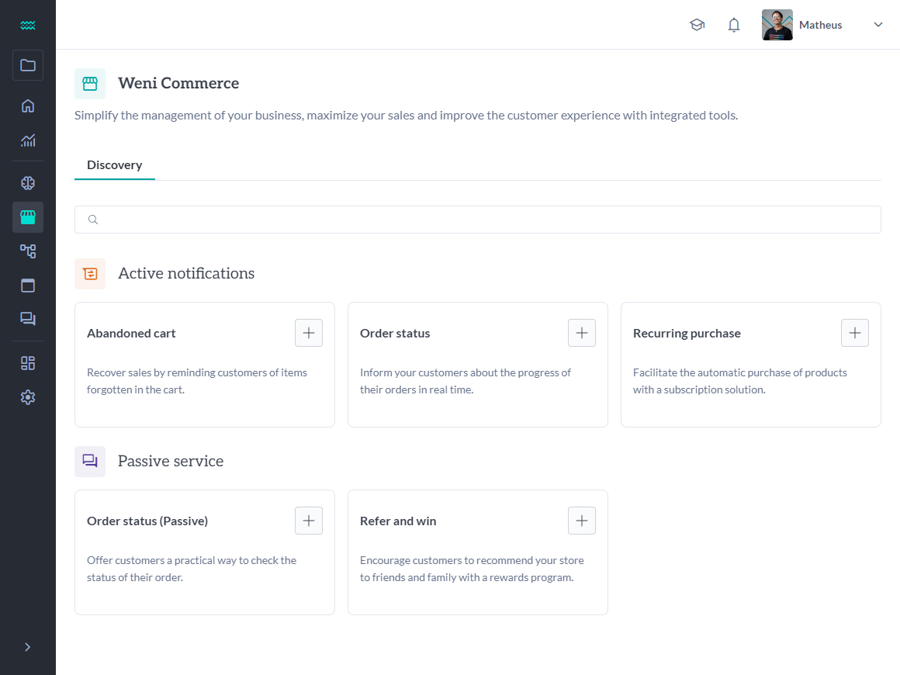

<div align="center">


[](https://codecov.io/github/weni-ai/commerce-webapp) [](https://opensource.org/licenses/MPL-2.0)

*This project is a module of [Weni](https://github.com/weni-ai) integrated inside [Weni WebApp (Connect)](https://github.com/weni-ai/weni-webapp)*

# :shopping: Commerce

This repository is responsible for all Weni - Artificial Intelligence-related projects. It hosts the documentation and other misc. resources for  Weni - Artificial Intelligence. Code for other projects, like the [Engine](https://github.com/bothub-it/bothub-engine), [NLP Worker](https://github.com/bothub-it/bothub-nlp), [NLP API](https://github.com/bothub-it/bothub-nlp-api) and [NLP On Demand](https://github.com/bothub-it/bothub-nlp-on-demand), are hosted in other repositories.

</div>

# About Commerce

Weni - Artificial Intelligence is an open platform for predicting, training and sharing NLU (Natural Language Understanding) datasets in multiple languages in a cooperative way. with Weni - Artificial Intelligence, you can not only create NLP datasets, but you can also access, use and evolve datasets that were already built by other users in the community! These collaboration methods + integration options make it easier for the user to apply NLU concepts in different platforms and contexts.
<!-- > [Usability documentation](https://docs.weni.ai/l/pt/bothub) -->



# Main Technologies

- [Unnnic](https://github.com/weni-ai/unnnic) (Weni's design system)
- [Vue 3](https://vuejs.org/)
- [Vue I18n](https://kazupon.github.io/vue-i18n/)
- [Sass](https://sass-lang.com/)
- [Axios](https://axios-http.com/docs/intro)

# Requirements

Before running the application, make sure you have installed the following tools on your machine or that you have Docker installed:

- [Node.js 18.x](https://nodejs.org/en)
- [NPM](https://www.npmjs.com/) or [Yarn](https://yarnpkg.com/) (recommended)

# commerce-webapp

This template should help get you started developing with Vue 3 in Vite.

## Recommended IDE Setup

[VSCode](https://code.visualstudio.com/) + [Volar](https://marketplace.visualstudio.com/items?itemName=Vue.volar) (and disable Vetur).

## Type Support for `.vue` Imports in TS

TypeScript cannot handle type information for `.vue` imports by default, so we replace the `tsc` CLI with `vue-tsc` for type checking. In editors, we need [Volar](https://marketplace.visualstudio.com/items?itemName=Vue.volar) to make the TypeScript language service aware of `.vue` types.

## Customize configuration

See [Vite Configuration Reference](https://vitejs.dev/config/).

## Project Setup

```sh
npm install
```

### Compile and Hot-Reload for Development

```sh
npm run dev
```

### Type-Check, Compile and Minify for Production

```sh
npm run build
```

### Run Unit Tests with [Vitest](https://vitest.dev/)

```sh
npm run test:unit
```

### Lint with [ESLint](https://eslint.org/)

```sh
npm run lint
```
